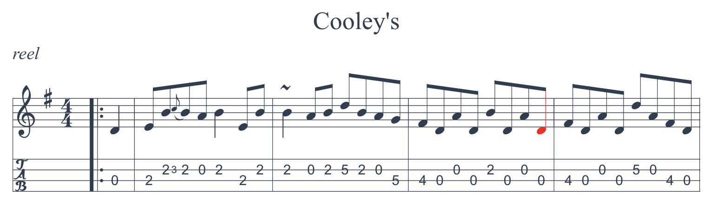

# ABC Sheet Music Plugin for Joplin

This plugins for [Joplin](https://joplinapp.org) renders ABC notation into sheet music. You create a fenced block with "abc" as identifier, and the content is rendered to a sheet music:

	```abc
	K:F
	!f!(fgag-g2c2)|
	```

For example:


## Installation

In [Joplin](https://joplinapp.org), open the configuration screen, then under "Plugins" search for "ABC".

## Configuration

### Global options

In the configuration screen, you can set additional options for the ABC renderer. See the [official ABC documentation](https://paulrosen.github.io/abcjs/visual/render-abc-options.html) for the full list of options. You need to set them as a [JSON5 object](https://json5.org/).

For example, this would make the foreground colour red, and will make the music twice as big:

```js
{ foregroundColor: "#ff0000", scale: 2 }
```

### Per sheet options

You can also activate options for a particular sheet music. To do so, add a header to the ABC markup, separated by `---`, which will contain the renderer options.

For example, this would add violin tablatures to the sheet music:

	```abc
	{tablature: [{instrument: 'violin'}]}
	---

	X:1
	T: Cooley's
	M: 4/4
	L: 1/8
	R: reel
	K: G
	|:D2|EB{c}BA B2 EB|~B2 AB dBAG|FDAD BDAD|FDAD dAFD|
	```



Note that even in this case the global options still apply. The per-sheet options simply override the global ones if there's a conflict.

## More info

- The ABC Notation official website, with lessons and examples to learn the notation: https://abcnotation.com
- The ABC Standard: https://abcnotation.com/wiki/abc:standard
