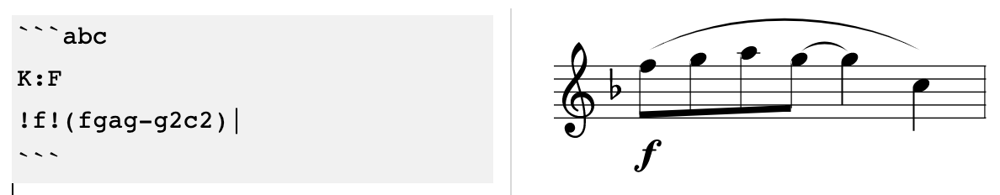

# ABC Sheet Music Plugin for Joplin

This plugins renders ABC notation into sheet music. You create a fenced block with "abc" as identifier, and the content is rendered to a sheet music:

	```abc
	K:F
	!f!(fgag-g2c2)|
	```

For example:



## Installation

In Joplin, open the configuration screen, then under "Plugins" search for "ABC".

## More info

- The ABC Notation official website, with lessons and examples to learn the notation: https://abcnotation.com
- The ABC Standard: https://abcnotation.com/wiki/abc:standard
